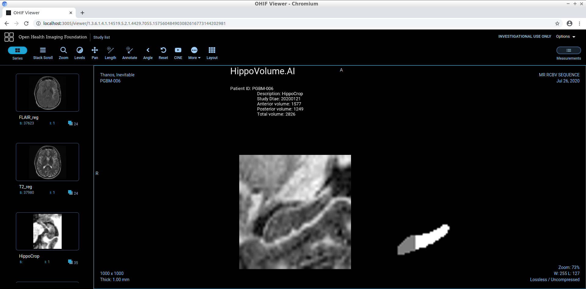

# Alzheimer-Udacity
This is the second project in fulfilment of the **AI for Healthcare** *Udacity Nanodegree*. The project uses brain MRI image stack to locate the hippocampus and compute its volume which is a prognostic measure for Alzheimer’s progression. The following Background and project description are excerpts of *Udacity* project space.

## Backround
Alzheimer's disease (AD) is a progressive neurodegenerative disorder that results in impaired neuronal (brain cell) function and eventually, cell death. AD is the most common cause of dementia. Clinically, it is characterized by memory loss, inability to learn new material, loss of language function, and other manifestations.
For patients exhibiting early symptoms, quantifying disease progression over time can help direct therapy and disease management.
A radiological study via MRI exam is currently one of the most advanced methods to quantify the disease. In particular, the measurement of hippocampal volume has proven useful to diagnose and track progression in several brain disorders, most notably in AD. Studies have shown a reduced volume of the hippocampus in patients with AD.
The hippocampus is a critical structure of the human brain (and the brain of other vertebrates) that plays important roles in the consolidation of information from short-term memory to long-term memory. In other words, the hippocampus is thought to be responsible for memory and learning

<figure>
  

  
  <figcaption>Source: Life Science Databases (LSDB). Hippocampus. Images are from Anatomography maintained by Life Science Databases (LSDB). (2010). CC-BY-SA 2.1jp. 
  <a href="https://commons.wikimedia.org/wiki/File:Hippocampus_small.gif">Link</a> </figcaption>
  

</figure>

Humans have two hippocampi, one in each hemisphere of the brain. They are located in the medial temporal lobe of the brain. According to [Nobis et al., 2019](https://www.sciencedirect.com/science/article/pii/S2213158219302542), the volume of hippocampus varies in a population, depending on various parameters, within certain boundaries, and it is possible to identify a "normal" range taking into account age, sex and brain hemisphere.

## Objective
An end-to-end AI system is built comprised of a machine learning algorithm that integrates into a clinical-grade viewer and automatically measures hippocampal volumes of new patients.
U-Net architecture is used to train the model on the MRI images and the corresponding hippocampus segments in NIFTI format. Finally, the model is integrated into a working clinical PACS such that it runs on every incoming study and produces a report with volume measurements. Following packages are used:
* [PyTorch](https://pytorch.org/)
* [nibabel](https://nipy.org/nibabel/)
* [matplotlib](https://matplotlib.org/users/installing.html)
* [numpy](https://numpy.org/)
* [pydicom](https://pydicom.github.io/pydicom/stable/tutorials/installation.html)
* [Pillow](https://pillow.readthedocs.io/en/stable/installation.html)
* [tensorboard](https://pypi.org/project/tensorboard/)

Following software products were provided by *Udacity Workspace* in the 3rd section of the project for emulating the clinical network:
*	[Orthanc server](https://www.orthanc-server.com/download.php) for PACS emulation
*	[OHIF zero-footprint web viewer](https://docs.ohif.org/development/getting-started.html) for viewing images
*	[DCMTK tools](https://dcmtk.org/) for testing and emulating a modality

## Dataset
Hippocampus dataset are obtained from the [Medical Decathlon competition](http://medicaldecathlon.com/). Dataset consists of NIFTI files each of which represents a volume and the corresponding segmentation mask. The original images are T2 MRI scans of the full brain, however, only the region of interest (hippocampus) is cropped and studied. This allows for simpler, faster training of the model. The training set is provided by [Udacity](https://github.com/udacity/nd320-c3-3d-imaging-starter/tree/master/data/TrainingSet).

## Project Phases
### Phase 1: EDA & Data Cleanup
As mentioned earlier only the hippocampus region is fed to the model. The [EDA](Section1/EDA.ipynb) file analyses the dataset of images and labels (i.e. segments). Following is the snapshot of one dataset showing the image slices next the corresponding segment.

<figure>
  

  
  

  <figcaption>
 Sample of slices and corresponding segments. 
</figcaption>
</figure>

Using nibabel package, useful information such as NIFTI metadata, unit of measurement, sagittal and coronal plane, etc are extracted. The dataset is later inspected for any irregularities in file length, slice-label correspondence, ect. The curated dataset is exported for the next phase of the project, Section 2.

### Phase 2: Model/Training/Evaluation
#### Data preparation
Two scripts are in charge of preparing data to be fed to the model. One script loads the images and labels from the given root, followed by normalizing and resizing accordingly. 
Each image (slice) in a *image stack* and its corresponding label in the *label stack* are considered one training sample. To enforce this, [SlicesDataset](Section2/data_prep/SlicesDataset.py) is written based on *Dataset* class of Pytorch, which is then used in Pytorch *DataLoader* class to sort and prepare samples for training.

#### Model architecture
Recursive [U-Net](https://arxiv.org/abs/1505.04597) model is used from *Division of Medical Image Computing, German Cancer Research Center (DKFZ)* and can be found [here](Section2/networks/RecursiveUNet.py).

#### Model training
The training algorithm is provided in [UNetExperiment](Section2/experiments/UNetExperiment.py) class which uses *Udacity* GPU environment. Adam optimizer is used with *learning rate scheduler* to decrease () upon plateau trend on validation loss. Tensorboard is used to log the validation results and model parameters are saved after each epoch. Since there are 3 classes of labels (0: nothing, 1: interior, 2: posterior), cross entropy loss is used. 
To evaluate the model, Dice and Jaccard metrics are implemented on the test result. The functions of these two metrics are provided in this [script](Section2/utils/volume_stats.py). Note that, neither method distinguishes posterior/interior region, thereby the whole segmented zone is taken into account.

[run_ml_pipeline.py](Section2/run_ml_pipeline.py) script is provided to setup the training parameters, sort the train/validation/test sets, start the training and test, and record the results as a *json* file.

### Phase 3: Clinical Integration
This section uses *Udacity workspace* and the provided software to integrate the ML pipline into a simulated clinical environment for hippocampus evaluation in MRI images. [inference_dcm.py](Section3/inference_dcm.py) script is created to deploy the saved model on the MRI image stack, label the hippocampus, compute its volume and present the results in the image viewer as DICOM file. 

<figure>
  

  
  

  <figcaption>
 MRI image slice on the bottom left and its corresponding hippocampus segment on the right. A brief report is also prepared on top of the file indicating patient’s info and the computed hippocampus volume. 
</figcaption>
</figure>
